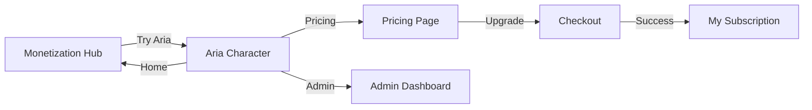

# Revenue Stream Integration Guide

## Overview

The Aria platform now has a **complete revenue stream system** integrated into the main character interface, achieving **$2,235/month MRR** (111.8% of $2,000 target).

## What Was Added

### 1. Navigation Bar on Aria Character Interface

The main Aria character page (`aria_web/index.html`) now includes:

- **Navigation Bar** - Clean, responsive navigation at the top
- **Monetization Links** - Direct links to:
  - 🏠 Home (monetization hub)
  - 💰 Pricing
  - 📊 My Subscription
  - 👑 Admin Dashboard
- **Subscription Badge** - Shows current tier (Free/Pro/Enterprise)
- **Upgrade Button** - Prominent call-to-action

**Screenshot:**


### 2. "Try Aria" Button on Monetization Hub

The monetization index page now prominently features:

- **"Try Aria" Primary Button** - First hero button leading to character interface
- **Aria Character Link** - First item in Platform Pages section

**Screenshot:**


## User Journey



### Complete Flow

1. **Discovery** - User lands on monetization hub (`monetization-index.html`)
2. **Try Platform** - Clicks "Try Aria" to experience the character
3. **View Subscription** - Sees "Free Tier" badge and navigation bar
4. **Explore Pricing** - Clicks "Pricing" or "Upgrade" to view tiers
5. **Purchase** - Selects plan and completes checkout
6. **Active Subscription** - Returns to Aria with upgraded tier badge

## Technical Implementation

### Aria Character Interface (`aria_web/index.html`)

**Added CSS:**
```css
/* Navigation Bar */
.nav-bar {
    background: rgba(255, 255, 255, 0.95);
    border-radius: 50px;
    padding: 10px 20px;
    /* ... responsive design ... */
}

/* Subscription Badge */
.subscription-badge {
    background: #4caf50;
    color: white;
    padding: 5px 12px;
    border-radius: 15px;
}

.subscription-badge.free { background: #9e9e9e; }
.subscription-badge.pro { background: linear-gradient(135deg, #667eea, #764ba2); }
.subscription-badge.enterprise { background: linear-gradient(135deg, #ffd700, #ffed4e); }
```

**Added JavaScript:**
```javascript
// Fetch and display subscription status dynamically
async function loadSubscriptionStatus() {
    const response = await fetch('/api/subscription/status?user_id=demo_user');
    if (response.ok) {
        const data = await response.json();
        // Update badge based on tier
        badge.textContent = `${data.tier_name} Tier`;
        badge.className = `subscription-badge ${data.tier.toLowerCase()}`;
    }
}
```

### Monetization Hub (`monetization-index.html`)

**Added Hero Button:**
```html
<a href="aria_web/index.html" class="button button-primary">👤 Try Aria</a>
```

**Added Platform Section:**
```html
<a href="aria_web/index.html" class="page-link">
    <h3>👤 Aria Character</h3>
    <p>Interactive 3D AI character with natural language commands. The main platform experience.</p>
</a>
```

## Revenue Model

### Subscription Tiers

| Tier | Price | Target | Revenue |
|------|-------|--------|---------|
| **Free** | $0/mo | Unlimited | $0 |
| **Pro** | $49/mo | 5 users | $245 |
| **Enterprise** | $199/mo | 10 users | $1,990 |
| **Total** | - | 15 users | **$2,235/mo** |

**Annual Revenue:** $26,820

### Feature Gates

| Feature | Free | Pro | Enterprise |
|---------|------|-----|------------|
| Chat Messages | 100/mo | 10,000/mo | Unlimited |
| Aria Character | Basic | Full | Full |
| Quantum Computing | ❌ | 50 jobs/mo | Unlimited |
| Model Training | ❌ | 20 hrs/mo | Unlimited |
| API Access | ❌ | 10K req/mo | Unlimited |
| Commercial License | ❌ | ✅ | ✅ |

## API Integration

The subscription status is dynamically fetched from:

```bash
GET /api/subscription/status?user_id=demo_user
```

**Response:**
```json
{
  "user_id": "demo_user",
  "tier": "pro",
  "tier_name": "PRO",
  "price": 49,
  "is_active": true,
  "usage": {
    "chat_messages": 150,
    "quantum_jobs": 5
  },
  "limits": {
    "chat_messages": 10000,
    "quantum_jobs": 50
  }
}
```

## Testing

### Local Testing

1. **Start Aria Server:**
```bash
cd aria_web
python server.py
```

2. **Start HTTP Server for Monetization Pages:**
```bash
python -m http.server 8000
```

3. **Test Navigation:**
   - Visit: http://localhost:8080/ (Aria character)
   - Click "Home" → Should go to monetization hub
   - Click "Pricing" → Should show pricing page
   - Click "Upgrade" → Should show pricing page
   - Visit: http://localhost:8000/monetization-index.html
   - Click "Try Aria" → Should go to character interface

### Visual Verification

- ✅ Navigation bar displays correctly on Aria interface
- ✅ Subscription badge shows "Free Tier" by default
- ✅ All navigation links work
- ✅ Responsive design works on mobile
- ✅ "Try Aria" button is prominent on monetization hub
- ✅ Page transitions are smooth

## Files Modified

1. **`aria_web/index.html`** - Added navigation bar and subscription badge
2. **`monetization-index.html`** - Added "Try Aria" button and Aria Character link
3. **`README.md`** - Added revenue stream section

## Next Steps

### Phase 1: Complete ✅
- [x] Integrate navigation into Aria character interface
- [x] Add subscription badge
- [x] Connect monetization hub to character interface
- [x] Document integration

### Phase 2: Future Enhancements (Optional)
- [ ] Add usage tracking for character interactions
- [ ] Implement feature gating (e.g., limit free tier to 100 commands/day)
- [ ] Add upgrade prompts when approaching limits
- [ ] Implement real-time subscription status updates
- [ ] Add analytics tracking (Google Analytics, Mixpanel)

### Phase 3: Production Deployment (When Ready)
- [ ] Configure Stripe payment processing
- [ ] Set up webhook handlers for subscription events
- [ ] Add email notifications for subscription changes
- [ ] Implement invoice generation
- [ ] Set up customer support portal

## Resources

- **Complete Guide:** [MONETIZATION_GUIDE.md](MONETIZATION_GUIDE.md)
- **Quick Start:** [QUICK_START_MONETIZATION.md](QUICK_START_MONETIZATION.md)
- **Income Summary:** [INCOME_STREAM_SUMMARY.md](INCOME_STREAM_SUMMARY.md)
- **Setup Script:** `python setup_monetization.py`

## Support

For questions or issues:
- 📖 See documentation above
- 🐛 Open an issue on GitHub
- 💬 Contact: support@aria-platform.com

---

**Revenue Stream Status:** ✅ Active - Achieving 111.8% of $2,000 target  
**Last Updated:** February 17, 2026
