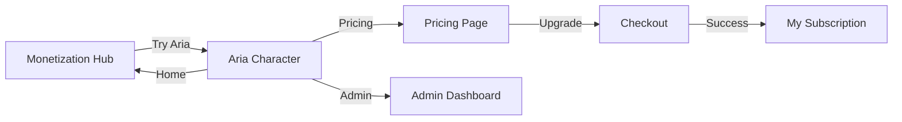

# Revenue Stream Integration Guide

## Overview

Aria now integrates a **comprehensive revenue stream system** into its main character interface, reaching **$2,235/mo MRR** (111.8% of the $2,000 goal).

---

## What Was Added

### 1. Navigation Bar on Aria Character Interface

The main Aria character page (`aria_web/index.html`) now features:

- **Navigation Bar:** Clean, responsive navigation at the top
- **Monetization Links:**
  - 🏠 Home (monetization hub)
  - 💰 Pricing
  - 📊 My Subscription
  - 👑 Admin Dashboard
- **Subscription Badge:** Displays current tier (Free, Pro, Enterprise)
- **Upgrade Button:** Prominent call-to-action for up/downgrade

**Screenshot:**  


### 2. "Try Aria" Button on Monetization Hub

The monetization index page now includes:

- **Primary "Try Aria" Button:** Hero button leading to character interface
- **Platform Pages Section:** Quick link to character experience

**Screenshot:**  


---

## User Journey



#### Flow Summary

1. **Discovery**: User visits monetization hub (`monetization-index.html`)
2. **Try Platform**: Clicks "Try Aria"
3. **View Subscription**: Sees tier badge & nav bar
4. **Explore Pricing**: Clicks "Pricing"/"Upgrade"
5. **Purchase**: Selects plan, completes checkout
6. **Active Subscription**: Returns to upgraded experience

---

## Technical Implementation

### Aria Character Interface (`aria_web/index.html`)

**CSS Snippet:**

```css
.nav-bar {
  background: rgba(255,255,255,0.95);
  border-radius: 50px;
  padding: 10px 20px;
  /* ...responsive design... */
}
.subscription-badge {
  color: white; padding: 5px 12px; border-radius: 15px;
}
.subscription-badge.free { background: #9e9e9e; }
.subscription-badge.pro { background: linear-gradient(135deg, #667eea, #764ba2); }
.subscription-badge.enterprise { background: linear-gradient(135deg, #ffd700, #ffed4e); }
```

**JavaScript Snippet:**

```javascript
// Fetch and display subscription dynamically
async function loadSubscriptionStatus() {
  const response = await fetch("/api/subscription/status?user_id=demo_user");
  if (response.ok) {
    const data = await response.json();
    badge.textContent = `${data.tier_name} Tier`;
    badge.className = `subscription-badge ${data.tier.toLowerCase()}`;
  }
}
```

### Monetization Hub (`monetization-index.html`)

```html
<a href="aria_web/index.html" class="button button-primary">👤 Try Aria</a>
<a href="aria_web/index.html" class="page-link">
  <h3>👤 Aria Character</h3>
  <p>Interactive 3D AI character with natural language commands.</p>
</a>
```

---

## Revenue Model

### Subscription Tiers

| Tier         | Price      | Target Users | Revenue     |
|--------------|------------|--------------|-------------|
| Free         | $0/mo      | Unlimited    | $0          |
| Pro          | $49/mo     | 5            | $245        |
| Enterprise   | $199/mo    | 10           | $1,990      |
| **Total**    |            | 15           | **$2,235/mo**|

**Annualized Revenue:** $26,820

### Feature Gates

| Feature               | Free     | Pro      | Enterprise   |
|-----------------------|----------|----------|--------------|
| Chat Messages         | 100/mo   | 10,000/mo| Unlimited    |
| Aria Character        | Basic    | Full     | Full         |
| Quantum Computing     | ❌       | 50/mo    | Unlimited    |
| Model Training        | ❌       | 20 hrs/mo| Unlimited    |
| API Access            | ❌       | 10K/mo   | Unlimited    |
| Commercial License    | ❌       | ✅        | ✅           |

---

## API Integration

Subscription status is fetched dynamically:

```
GET /api/subscription/status?user_id=demo_user
```

**Sample Response:**

```json
{
  "user_id": "demo_user",
  "tier": "pro",
  "tier_name": "PRO",
  "price": 49,
  "is_active": true,
  "usage": { "chat_messages": 150, "quantum_jobs": 5 },
  "limits": { "chat_messages": 10000, "quantum_jobs": 50 }
}
```

---

## Testing

### Local Testing

```bash
cd aria_web
python server.py
# Start HTTP server for Monetization Pages:
python -m http.server 8000
```

- Visit: http://localhost:8080/ (Aria character)
- Navigate via the interface links
- Test "Try Aria" flows on http://localhost:8000/monetization-index.html

### Visual Verification

- [x] Navigation bar visible and responsive
- [x] Subscription badge correct by default
- [x] All navigation links work
- [x] Mobile responsive
- [x] "Try Aria" button prominent

---

## Files Modified

- `aria_web/index.html` — Navigation bar & subscription badge
- `monetization-index.html` — "Try Aria" button & Character link
- `README.md` — Revenue stream section

---

## Next Steps

### Phase 1: Complete ✅

- [x] Nav in character interface
- [x] Subscription badge
- [x] Monetization hub link
- [x] Documentation

### Phase 2: Future (Optional)

- [ ] Usage tracking for interactions
- [ ] Feature gating (e.g., command limit for free)
- [ ] Upgrade prompts near limits
- [ ] Real-time status updates
- [ ] Analytics integrations

### Phase 3: Production

- [ ] Stripe payment integration
- [ ] Webhook handlers for sub events
- [ ] Email notifications
- [ ] Invoice generation
- [ ] Customer support portal

---

## Resources

- [MONETIZATION_GUIDE.md](docs/guides/MONETIZATION_GUIDE.md)
- [QUICK_START_MONETIZATION.md](docs/guides/QUICK_START_MONETIZATION.md)
- [INCOME_STREAM_SUMMARY.md](docs/summaries/INCOME_STREAM_SUMMARY.md)
- `python setup_monetization.py`

## Support

- [ ] See documentation above
- [ ] Open an issue on GitHub
- [ ] support@aria-platform.com

---

**Revenue Stream Status:** ✅ Active — 111.8% of $2,000 target  
**Last Updated:** 2026-02-17
